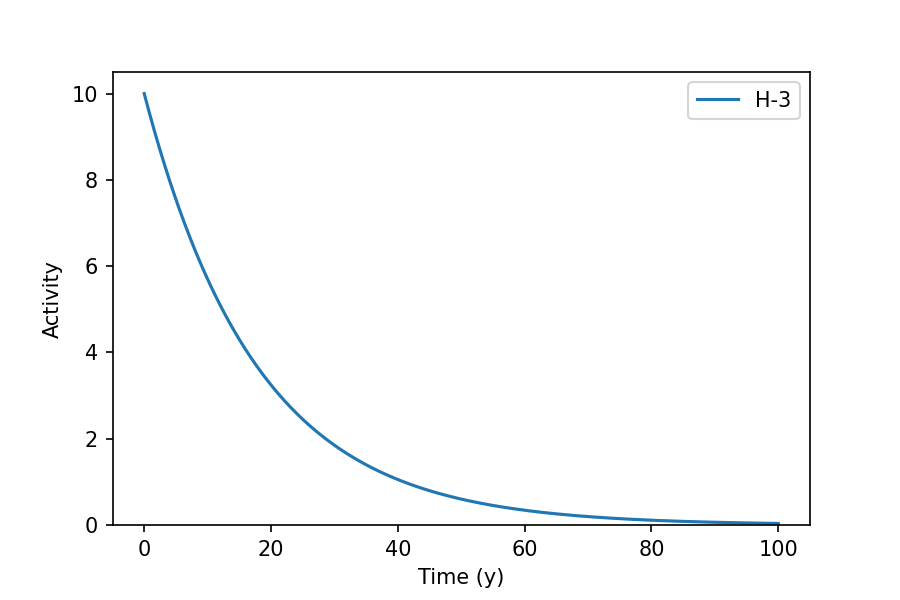
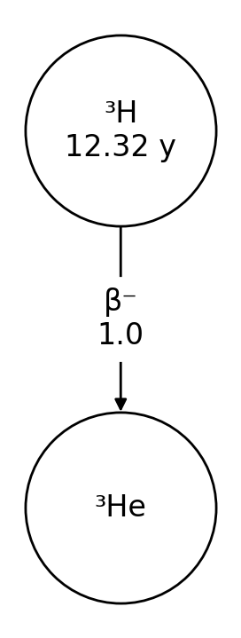

Overview
========

Introduction
------------

``radioactivedecay`` is a Python package for radioactive decay calculations.
It contains functions to define inventories of radionuclides, perform
decay calculations, and output decay data for radionuclides and decay chains.

The original goal was to create a light-weight Python package for radioactive
decay calculations, with full support for branching decays, multi-step decay
chains, and metastable states. By default ``radioactivedecay`` uses decay data
from ICRP Publication 107 :ref:`[1] <refs>` and atomic mass data from the
Atomic Mass Data Center (AME2020 and Nubase 2020 evaluations)
:ref:`[2] <refs>`, :ref:`[3] <refs>` and :ref:`[4] <refs>`. It solves the radioactive
decay differential equations analytically using basic linear algebra operations
:ref:`[5] <refs>`.

In order to use ``radioactivedecay``, you will need Python 3.6+ with the
Matplotlib, NetworkX, NumPy, SciPy and SymPy packages installed. The code is
platform independent and has been tested on Windows, MacOS and Linux systems.

Quick start
-----------

Install ``radioactivedecay`` using ``pip`` by:

.. code-block:: bash

    $ pip install radioactivedecay

or using ``conda`` by:

.. code-block:: bash

    $ conda install -c conda-forge radioactivedecay

Either command will attempt to install the dependencies (Matplotlib, NetworkX,
NumPy, SciPy & SymPy) if they are not already present in the environment.

Import the ``radioactivedecay`` package and decay a simple inventory using:

.. code-block:: python3

    >>> import radioactivedecay as rd
    >>> inv_t0 = rd.Inventory({'H-3': 10.0}, 'Bq')
    >>> inv_t1 = inv_t0.decay(12.32, 'y')
    >>> inv_t1.activities()
    {'H-3': 5.0}

Here we created an inventory of 10.0 Bq of tritium (:sup:`3`\H) and decayed
it for 12.32 years. The activity reduced by a factor of two, i.e. to 5.0 Bq,
as 12.32 years is the half-life of tritium.

Additional options for inputs and outputs include masses, moles and numbers of
atoms. Use the ``units`` argument to the ``Inventory()`` constructor, and the
``masses()``, ``moles()``, ``numbers()``, ``mass_fractions()``, and
``mole_fractions()`` methods to obtain results. 

.. code-block:: python3

    >>> inv_mass_t0 = rd.Inventory({'H-3': 3.2}, 'g')
    >>> inv_mass_t1 = inv_mass_t0.decay(12.32, 'y')
    >>> inv_mass_t1.masses('g')
    {'H-3': 1.6000000000000003, 'He-3': 1.5999894116584246}

    >>> inv_mol_t0 = rd.Inventory({'C-14': 1.0}, 'mol')
    >>> inv_mol_t1 = inv_mol_t0.decay(3000.0, 'y')
    >>> inv_mol_t1.moles('mol')
    {'C-14': 0.6943255713073281, 'N-14': 0.3056744286926719}
    >>> inv_mol_t1.numbers()
    {'C-14': 4.181326323680147e+23, 'N-14': 1.840814436319853e+23}
    >>> inv_mole_t1.mol_fractions()
    {'C-14': 0.6943255713073281, 'N-14': 0.3056744286926719}

Use the ``plot()`` method to show the decay of the inventory over time:

.. code-block:: python3

    >>> inv_t0.plot(100, 'y')

The graph shows the decay of H-3 over a 100 year period.

Use the ``Nuclide`` class to fetch decay data about a particular radionuclide
and to draw diagrams of its decay chain:

.. code-block:: python3

    >>> nuc = rd.Nuclide('H-3')
    >>> nuc.half_life('readable')
    '12.32 y'
    >>> nuc.progeny()
    ['He-3']
    >>> nuc.decay_modes()
    ['β-']
    >>> nuc.branching_fractions()
    [1.0]
    >>> nuc.plot()

How it works
------------

``radioactivedecay`` calculates an analytical solution to the decay chain
differential equations using matrix and vector multiplications. It implements
the method described in ref. :ref:`[5] <refs>`.  See the
:doc:`theory docpage <theory>` for
more details. It calls NumPy :ref:`[6] <refs>` and SciPy :ref:`[7] <refs>` for
the matrix operations. There is also a high numerical precision decay
calculation mode based on SymPy :ref:`[8] <refs>` routines.

The `notebooks directory 
<https://github.com/radioactivedecay/radioactivedecay/tree/main/notebooks>`_ 
in the GitHub repository contains some Jupyter Notebooks for creating the 
`ICRP-107 decay dataset
<https://github.com/radioactivedecay/radioactivedecay/tree/main/notebooks/icrp107_dataset/icrp107_dataset.ipynb>`_
for ``radioactivedecay``, and cross-checks against `PyNE
<https://github.com/radioactivedecay/radioactivedecay/tree/main/notebooks/comparisons/pyne/rd_pyne_truncated_compare.ipynb>`_ 
:ref:`[9] <refs>` and `Radiological Toolbox 
<https://github.com/radioactivedecay/radioactivedecay/tree/main/notebooks/comparisons/radiological_toolbox/radiological_toolbox_compare.ipynb>`_
:ref:`[10] <refs>`.

Limitations
-----------

At present ``radioactivedecay`` has the following limitations:

* It does not model neutronics, so cannot calculate radioactivity produced
  from neutron-nuclear reactions inducing radioactivity or fission.
* It cannot model temporal sources of external radioactivity input or removal
  from an inventory over time.
* Care is needed when decaying backwards in time, i.e. supplying a negative
  argument to the ``Inventory.decay()`` method, as this can result in numerical
  instabilities and nonsensical results. The high precision
  ``InventoryHP.decay()`` is more robust to these instabilities, but not immune
  from them.

There are also some limitations associated with the ICRP-107 decay dataset:

* ICRP-107 does not contain data on branching fractions for radionuclides
  produced from spontaneous fission decays. Thus the ``decay()`` methods do not
  calculate activities for spontaneous fission progeny.
* Decay data is quoted in ICRP-107 with up to 5 significant figures of
  precision. The results of decay calculations will therefore in theory never
  be more precise than this level of precision.
* Uncertainties are not quoted for the radioactive decay data in ICRP-107.
  Uncertainties will vary substantially between radionuclides. They will depend
  on how well each radionuclide has been researched in the past. In many cases
  these uncertainties will be more significant for the results of decay
  calculations than the previous point about the quoted precision of the
  ICRP-107 decay data.
* There are a few instances where minor decay pathways were not included in
  ICRP-107, e.g. the decay pathways for At-219-> Rn-219 (|beta| ~3%), Es-250 ->
  Bk-246 (|alpha| ~1.5%), and U-228 -> Pa-228 (|epsilon| ~2.5%). For more
  details see refs. :ref:`[11] <refs>` and :ref:`[12] <refs>` on the creation of
  the ICRP-107 dataset.

License
-------

.. include:: <isonum.txt>

``radioactivedecay`` is open source software released under the `MIT 
<https://github.com/radioactivedecay/radioactivedecay/blob/master/LICENSE>`_ licence.

The default decay data used by ``radioactivedecay`` is ICRP-107 :ref:`[1] <refs>`, which
is Copyright |copy| A. Endo and K.F. Eckerman (2008). See `LICENSE.ICRP-07
<https://github.com/radioactivedecay/radioactivedecay/blob/master/LICENSE.ICRP-07>`_
for more details.

The default atomic mass data is based on the Atomic Mass Data Center (`AMDC
<https://www-nds.iaea.org/amdc/>`_) AME2020 :ref:`[2] <refs>`,
:ref:`[3] <refs>` and Nubase2020 :ref:`[4] <refs>` evaluations. See
`LICENSE.AMDC
<https://github.com/radioactivedecay/radioactivedecay/blob/master/LICENSE.AMDC>`_ for
more details.

Contributors
------------

List of contributors to ``radioactivedeay``:

* `Alex Malins <https://alexmalins.com>`_
* `Thom Lemoine <https://github.com/lemointm>`_

Contributing
------------

Users are welcome to fix bugs, add new features or make feature requests.
Please read the `contributor guidelines
<https://github.com/radioactivedecay/radioactivedecay/blob/master/CONTRIBUTING.md>`_
and open a pull request or issue on the
`GitHub repository <https://github.com/radioactivedecay/radioactivedecay>`_.

Queries and suggestions
-----------------------

If you have any questions or suggestions, please post on the `Discussions page
on GitHub <https://github.com/radioactivedecay/radioactivedecay/discussions>`_.

Acknowledgements
----------------

Special thanks to:

* `Center for Computational Science & e-Systems, JAEA <https://ccse.jaea.go.jp/index_eng.html>`_
* `Kenny McKee <https://github.com/Rolleroo>`_
* `Daniel Jewell <https://github.com/danieldjewell>`_
* `Ezequiel Pássaro <https://epassaro.github.io/>`_
* `Shyam Dwaraknath <https://github.com/shyamd>`_
* `Wolfgang Kerzendorf <https://wkerzendorf.github.io/>`_
* `Hunter Ratliff <https://hratliff.com/>`_
* `Jayson Vavrek <https://github.com/jvavrek>`_

for suggestions, support and assistance to this project.

Thanks also to:

* `Björn Dahlgren <https://github.com/bjodah>`_ (creator of the batemaneq
  Python package :ref:`[13] <refs>`)
* `Anthony Scopatz <https://github.com/scopatz>`_ and the PyNE project
  :ref:`[9] <refs>`
* `Jonathan Morrell <https://github.com/jtmorrell>`_ (creator of the `NPAT
  <https://github.com/jtmorrell/npat>`_ and `Curie
  <https://github.com/jtmorrell/npat>`_ packages)

for their work on open source radioactive decay calculation software.

.. _refs:

References
----------

1. ICRP Publication 107: Nuclear Decay Data for Dosimetric Calculations. Ann. ICRP 38 (3), 1-96 (2008). `PDF <https://journals.sagepub.com/doi/pdf/10.1177/ANIB_38_3>`_
2. W.J. Huang et al. Chinese Phys. C 45, 030002 (2021). DOI: `10.1088/1674-1137/abddb0 <https://doi.org/10.1088/1674-1137/abddb0>`_
3. Meng Wang et al. Chinese Phys. C 45, 030003 (2021). DOI: `10.1088/1674-1137/abddaf <https://doi.org/10.1088/1674-1137/abddaf>`_
4. F.G. Kondev et al. Chinese Phys. C 45, 030001 (2021). DOI: `10.1088/1674-1137/abddae <https://doi.org/10.1088/1674-1137/abddae>`_
5. M Amaku, PR Pascholati & VR Vanin, Comp. Phys. Comm. 181, 21-23 (2010). DOI: `10.1016/j.cpc.2009.08.011 <https://doi.org/10.1016/j.cpc.2009.08.011>`_
6. CR Harris et al. Nat. 585, 357-362 (2020). DOI: `10.1038/s41586-020-2649-2 <https://doi.org/10.1038/s41586-020-2649-2>`_
7. P Virtanen et al. Nat. Methods 17, 261-272 (2020). DOI: `10.1038/s41592-019-0686-2 <https://doi.org/10.1038/s41592-019-0686-2>`_
8. A Meurer et al. PeerJ Comp. Sci. 3, e103 (2017). DOI: `10.7717/peerj-cs.103 <https://doi.org/10.7717/peerj-cs.103>`_
9. PyNE: The Nuclear Engineering Toolkit. `https://pyne.io/ <https://pyne.io/>`_
10. KF Eckerman, AL Sjoreen & C Sun, Radiological Toolbox, Oak Ridge National Laboratory. `https://www.ornl.gov/crpk/software <https://www.ornl.gov/crpk/software>`_
11. A Endo, Y Yamaguchi & KF Eckerman, JAERI 1347 (2005). DOI: `10.11484/jaeri-1347 <https://doi.org/10.11484/jaeri-1347>`_
12. A Endo & KF Eckerman, JAEA-Data/Code 2007-021 (2007). DOI: `10.11484/jaea-data-code-2007-021 <https://doi.org/10.11484/jaea-data-code-2007-021>`_
13. B Dahlgren, batemaneq:  a C++ implementation of the Bateman equation, and a Python binding thereof. `https://github.com/bjodah/batemaneq <https://github.com/bjodah/batemaneq>`_

.. |alpha| unicode:: U+03B1 .. lower case alpha
.. |beta| unicode:: U+03B2 .. lower case beta
.. |epsilon| unicode:: U+03B5 .. lower case epsilon
