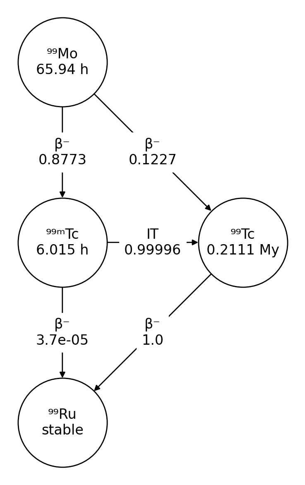
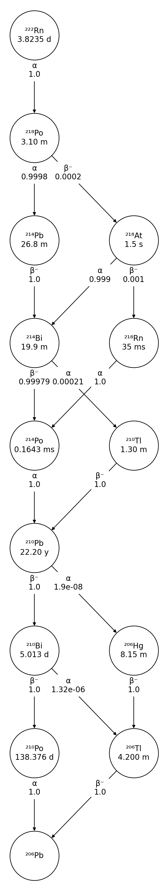
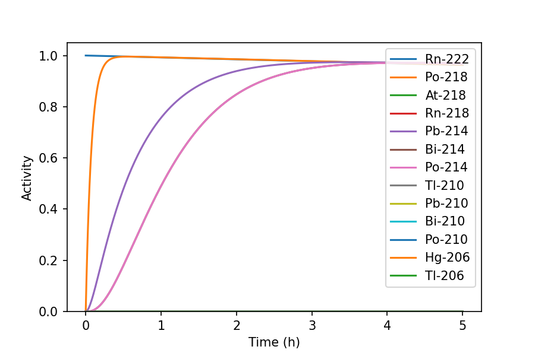
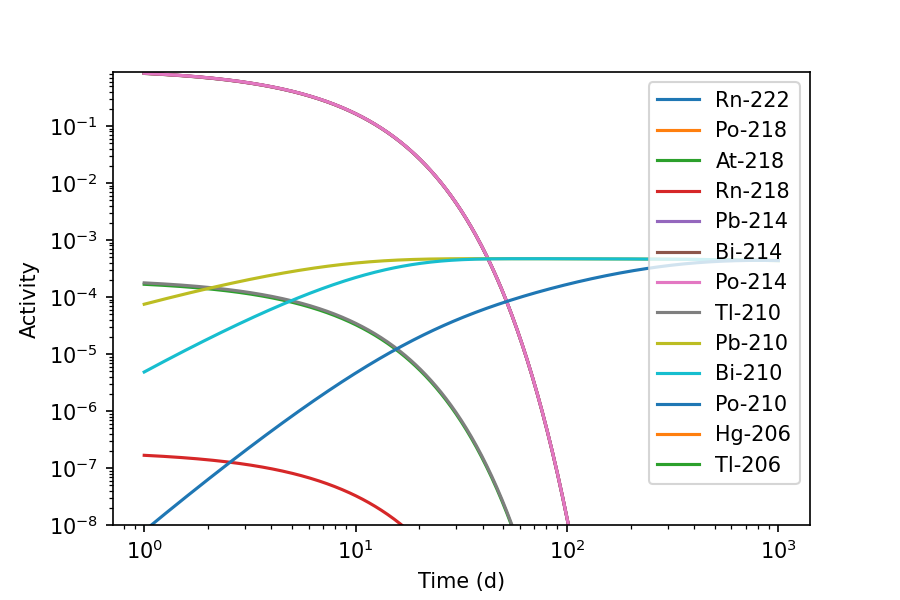
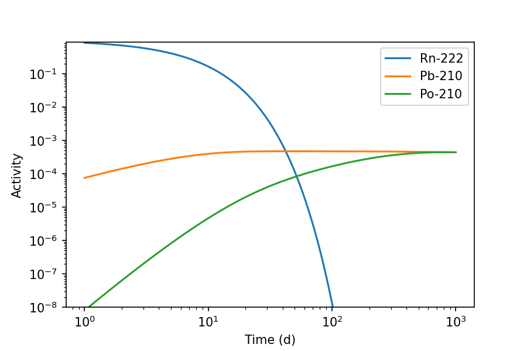
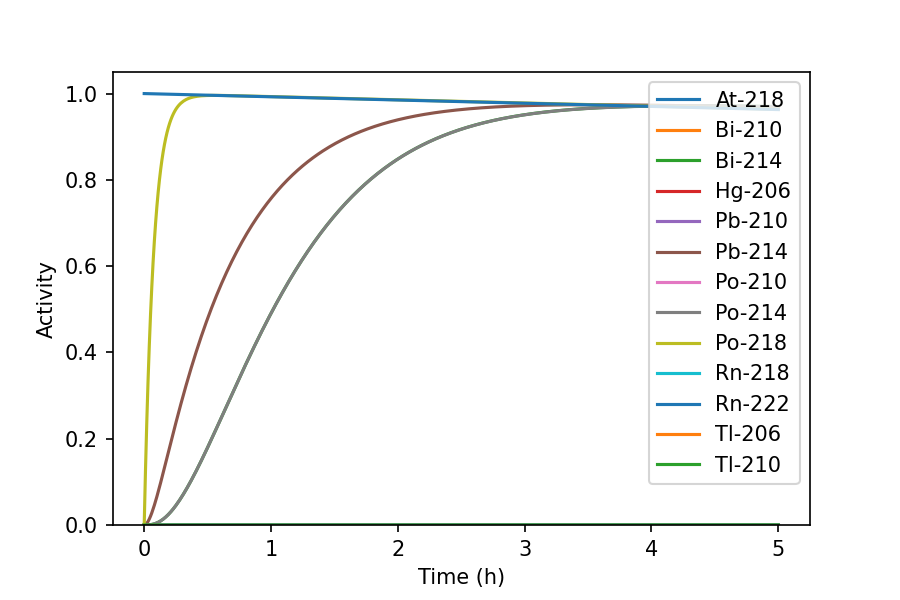

Plotting
========

Decay chain diagrams
--------------------

Use the ``Nuclide`` class ``plot()`` method to create a diagram of the
decay chain originating from a radionuclide:

.. code-block:: python3

    >>> import radioactivedecay as rd
    >>> nuc = rd.Nuclide('Mo-99')
    >>> fig, ax = nuc.plot()

  
The decay chain diagrams are drawn using NetworkX and Matplotlib. The
``plot()`` method returns the Matplotlib figure and axes objects containing
the decay chain diagram.
  
For more complicated decay chains, you can avoid decay mode and branching
fraction labels overlapping by adjusting the label_pos parameter from the
default value of 0.5:

.. code-block:: python3

    >>> import radioactivedecay as rd
    >>> nuc = rd.Nuclide('Rn-222')
    >>> fig, ax = nuc.plot(label_pos=0.66)

Inventory decay graphs
----------------------

The ``Inventory`` and ``InventoryHP`` class  ``plot()`` method is for creating
graphs of the radioactive decay of the nuclides in an inventory and their
progeny over time. At its simplest, supply the decay timespan to the method:

.. code-block:: python3

    >>> inv = rd.Inventory({'Rn-222': 10.0})
    >>> fig, ax = inv.plot(5, 'h')

The graph shows the ingrowth of short-lived Rn-222 progeny. Use parameters such
as ``xscale``, ``yscale``, ``xmin``, ``ymin`` and ``yunits`` to tailor the
graph to your own needs:

.. code-block:: python3

    >>> fig, ax = inv.plot(1000, 'd', xscale='log', yscale='log', xmin=1, ymin=1E-17, yunits='mg')

  
Now we can see the long-lived Pb-210 radionuclide and its progeny, which form
over a period of months. Large numbers of curves can make the graphs difficult
to read. Use the ``display`` parameter to specify only the nuclides you wish to
display. The curves follow the same order as the list you supply:

.. code-block:: python3

    >>> fig, ax = inv.plot(1000, 'd', display=['Rn-222', 'Pb-210', 'Po-210'], xscale='log', yscale='log', xmin=1, ymin=1E-8)

By default nuclides are plotted according to those highest in the decay chains
downwards. If you wish to display nuclides in alphabetical order, use the
``order`` parameter:

.. code-block:: python3

    >>> fig, ax = inv.plot(5, 'h', order='alphabetical')

  
The ``plot()`` method returns the Matplotlib figure and axes objects containing
the graph. These can be used to save the figure to the file or to replot it
with your own Matplotlib parameters, e.g. to save a PNG image:

.. code-block:: python3

    >>> fig.savefig('Rn-222.png', dpi=150)

For more information on handling the figure and axes objects, see the
`Matplotlib documentation <https://matplotlib.org/contents.html>`_.
